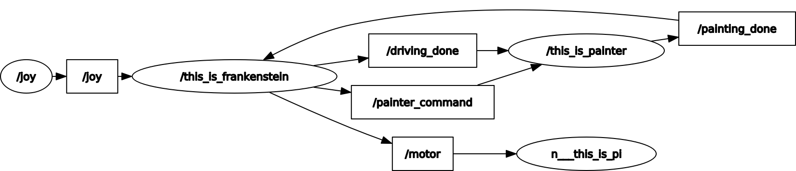
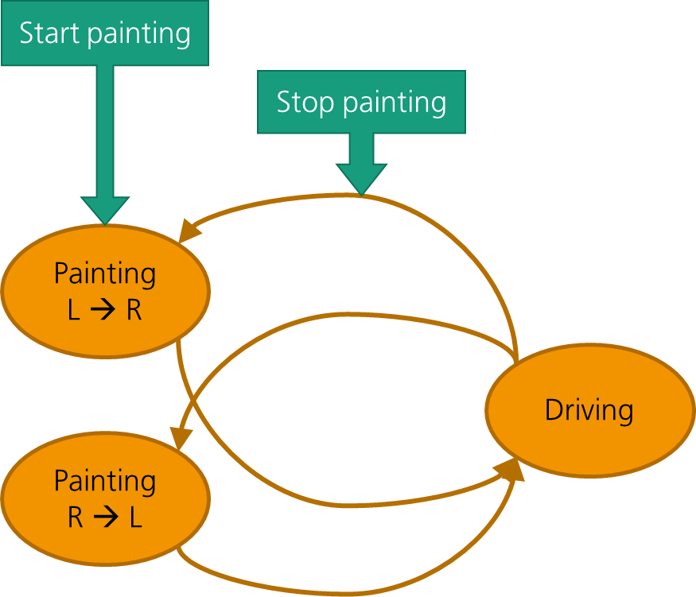

# Connect BlueROV Companion with ROS

Frankenstein :robot: lets you talk to the Raspberry Pi companion computer of a BlueROV system via ROS. It runs parallel to QGroundControl (QGC), which communicates with the ArduSub firmware on the Pixhawk1 autopilot (flight controller) to control the BlueROV. This means that you can extend the Raspberry Pi companion with hardware equipment that can be controlled via ROS, while at the same time maintaining ArduSub's normal functionality for ROV control and data logging.

## Table of Contents

1. [Prerequisites](#prerequisites)
2. [Installing Frankenstein](#installing-frankenstein)
3. [Launching Frankenstein](#launching-frankenstein)
4. [File Descriptions](#file-descriptions)
5. [Troubleshooting](#troubleshooting)
6. [To-Dos for Linear Unit Setup](#linear-unit-setup)

## Prerequisites

The system has been tested with the following setup:

- Ubuntu 20.04 (running in a VirtualBox Virtual Machine and on a laptop)
- ROS noetic (full desktop version) on the VM/laptop and ROS kinetic (bare bones version) on the companion
- BlueROV2 with ArduSub 4.0.2 and 4.0.3 and companion software 0.30
- QGroundControl 4.0.5 and 4.1.2
- Xbox One controller (wired via USB - because Bluetooth jumbles up the button assignment)

The following steps describe how this setup can be re-created on your machine.

### Setting up a laptop with Ubuntu 20.04

Follow these steps if you are running Ubuntu on a laptop.

<details><summary>Show steps</summary>

1. Open a terminal and install/update to the latest software:

   ```bash
   sudo apt update
   sudo apt upgrade
   sudo apt install gcc git make perl
   ```

2. Connect the BlueROV to the laptop.
3. Configure the network settings following the instructions in the ArduSub wiki [here](https://www.ardusub.com/quick-start/installing-companion.html#network-setup) (click the "Linux" button and scroll down for Ubuntu 18.04 instructions).
4. You should now be able to `ping 192.168.2.2` in the terminal.

</details>

### Setting up a Virtual Machine (VM) with Ubuntu 20.04

Follow these steps if you are running Ubuntu in a VM.

<details><summary>Show steps</summary>

1. Download and install [VirtualBox](https://www.virtualbox.org/wiki/Downloads).
2. Download and install matching VirtualBox Extension Pack.
3. Download [Ubuntu 20.04 iso](https://ubuntu.com/download/desktop).
4. Create a new VM with Ubuntu. Make sure you are using the "expert mode" to set a storage capacity of at least 20 GB (just to be sure), a few CPU cores, decent RAM and a graphic memory of 128 MB. I would also recommend enabling bidirectional shared clipboard and drag-and-drop.
5. Start the VM and select the Ubuntu iso file for startup. Do a full install of Ubuntu and make sure you are selecting the correct time zone and keyboard layout. I called my Ubuntu user "ros" with the same password for simplicity.
6. For initial startup, update the VM with the latest version of some basic software. Open a terminal and run:

   ```bash
   sudo apt update
   sudo apt upgrade
   sudo apt install gcc git make perl
   ```

7. Download and install matching Guest Additions (via menu bar - devices - insert guest additions). The easiest way to check if this worked is to have a look at menu bar - display - if the option "automatic scaling of guest display" is enabled, you are good to go.
8. Shut down the VM and change its USB options to 3.0 (xHCI).
9. In the USB options, create a USB filter that automatically catches the joystick controller and the ethernet-to-USB connector if you're using one. The easiest way to achieve this is to plug them in and then select them via the :electric_plug: :heavy_plus_sign: button.
10. Start the VM and connect both USB devices to make sure they are caught by the VM. If this doesn't work, have a look [here](https://forums.virtualbox.org/viewtopic.php?t=82639) at some troubleshooting options.
11. Configure the network settings following the instructions in the ArduSub wiki [here](https://www.ardusub.com/quick-start/installing-companion.html#network-setup) (click the "Linux" button and scroll down for Ubuntu 18.04 instructions).
12. You should now be able to `ping 192.168.2.2` in the terminal.
13. Optional: create a snapshot.

</details>

### Installing ROS and all dependencies on Ubuntu

Follow these instructions regardless of where you are running Ubuntu.

<details><summary>Show steps</summary>

1. Start a terminal and run the following command to add a few useful programs.

   ```bash
   sudo apt install jstest-gtk python-is-python3 python3-pip terminator vim
   ```

   `jstest-gtk` is a great little tool to check how your controller is configured.
   `terminator` is an advanced terminal that lets you split terminal windows and colour-code them. This is useful if you want to start and observe multiple ROS jobs at the same time (e.g., the Frankenstein node on Ubuntu and the node on the Pi).
   And `vim` is everyone's favourite text editor :nerd_face:

2. Install [ROS noetic](http://wiki.ros.org/noetic/Installation/Ubuntu) (full desktop version). The website goes into a lot of detail about the installation process. Here is a list of commands that you need to put into the terminal:

   ```bash
   sudo sh -c 'echo "deb http://packages.ros.org/ros/ubuntu $(lsb_release -sc) main" > /etc/apt/sources.list.d/ros-latest.list'
   sudo apt install curl
   curl -s https://raw.githubusercontent.com/ros/rosdistro/master/ros.asc | sudo apt-key add -
   sudo apt update
   sudo apt install ros-noetic-desktop-full
   ```

3. Install [QGroundControl](https://docs.qgroundcontrol.com/master/en/getting_started/download_and_install.html#ubuntu).
4. In the terminal, run the following command to install further dependencies:

   ```bash
   sudo apt install ros-noetic-joy gstreamer1.0-plugins-good gstreamer1.0-plugins-bad gstreamer1.0-libav python3-gi libgstreamer1.0-0 ffmpeg libsm6 libxext6
   ```

5. Connect the joystick and use jstest-gtk to find out which number it is (e.g., js0, js1, etc.). Simply run in the terminal:

   ```bash
   jstest-gtk
   ```

   If it is configured as `/dev/input/js2` then you are good to go. Otherwise, Frankenstein might have issues finding the right joystick path. Have a look at these [troubleshooting steps for joystick](#couldnt-open-joystick-devinputjs2) to tell Frankenstein where to look instead.
6. Add the following lines to the end of the `~.bashrc` file in your home directory (you might already have the first line from the ROS installation process). `.bashrc` is a hidden file so you might need to enable the checkbox in the hamburger menu of the Ubuntu explorer to find it.

   ```bash
   # Set up ROS environment. First load the standard ROS installation, then load our own packages.
   source /opt/ros/noetic/setup.bash
   source ~/catkin_ws/devel/setup.bash
   # Make sure roscore is started here as host.
   export ROS_IP=192.168.2.1
   export ROS_HOSTNAME=$ROS_IP
   export ROS_MASTER_URI=http://$ROS_IP:11311
   ```

:warning: Note that the `export` statements will make your ROS system want to start with the specified IP. If you are not connected with the BlueROV vie ethernet, you will not have this IP, so your roscore will not start properly.

</details>

### Installing ROS and all dependencies on the Raspberry Pi companion

<details><summary>Show steps</summary>

1. Connect to the Pi via terminal - either through the companion software's built-in [terminal](http://192.168.2.2:8088/) or via `ssh pi@192.168.2.2` with password `companion`.
2. Install ROS kinetic following these [instructions](https://discuss.bluerobotics.com/t/installing-ros-on-bluerov-companion/10946).
3. Frankenstein uses the [pigpio](http://abyz.me.uk/rpi/pigpio/python.html) library to run hardware PWM on the Pi's GPIO pins. Install it on the Pi and add it to the its autostart:

   ```bash
   sudo apt-get install python-pigpio python3-pigpio
   sudo systemctl enable pigpiod
   ```

4. Add the following lines to the `~.bashrc` (you might already have the first one from the ROS installation process). I used the `nano` tool for this as it's already installed on the Pi. Save and close the file by pressing Ctrl + x, then y, then Enter.

   ```bash
   # Set up ROS environment. First load the standard ROS installation, then load our own packages.
   source ~/ros_catkin_ws/install_isolated/setup.bash
   source ~/overlay_ws/devel/setup.bash
   # Make sure it connects to the remote roscore. IP belongs to surface computer.  
   export ROS_IP=192.168.2.1
   export ROS_HOSTNAME=$ROS_IP
   export ROS_MASTER_URI=http://$ROS_IP:11311
   # Hack this - otherwise it throws an error when autocompleting ROS commands in console with tab key.
   export LC_ALL=C
   ```

</details>

## Installing Frankenstein

### On Ubuntu

<details><summary>Show steps</summary>

1. Set up an SSH key for this repository as described [here](https://git.igd-r.fraunhofer.de/help/user/ssh.md#generate-an-ssh-key-pair) so you can download the source code. My recommendation for the "comment" is "Ubuntu machine".
2. Create a catkin workspace as described in the [ROS tutorial](http://wiki.ros.org/ROS/Tutorials/InstallingandConfiguringROSEnvironment#Create_a_ROS_Workspace).

   ```bash
   mkdir -p ~/catkin_ws/src
   cd ~/catkin_ws/
   catkin_make
   ```

3. Stay in the terminal and navigate to the source folder:

   ```bash
   cd ~/catkin_ws/src/
   ```

4. Clone the Frankenstein project (If `git clone` asks you if you trust this source, confirm that you do.)

   ```bash
   git clone git@git.igd-r.fraunhofer.de:sot/uwmaintenance/frankenstein.git
   ```

5. Clone the [frankenstein_msgs](https://git.igd-r.fraunhofer.de/sot/uwmaintenance/frankenstein_msgs) project. This package lets Frankenstein talk to his other components (crawler for driving and linear unit for painting).

   ```bash
   git clone git@git.igd-r.fraunhofer.de:sot/uwmaintenance/frankenstein_msgs.git
   ```

6. Clone the [frankenstein_painter](https://git.igd-r.fraunhofer.de/sot/uwmaintenance/frankenstein_painter) project and make the main file executable. This package connects Frankenstein to the linear unit. (At the moment, it is just a dummy but it is still required for the program logic.)

   ```bash
   git clone git@git.igd-r.fraunhofer.de:sot/uwmaintenance/frankenstein_painter.git
   chmod +x ~/catkin_ws/src/frankenstein_painter/src/frankenstein_painter.py
   ```

7. Go back to the workspace folder and make the projects:

   ```bash
   cd ~/catkin_ws/
   catkin_make
   ```

8. Reload the ROS environment: (Or simply close and restart the terminal, since we have already added this line to `.bashrc`.)

   ```bash
   source ~/catkin_ws/devel/setup.bash
   ```

</details>

### On the Raspberry Pi

<details><summary>Show steps</summary>

1. Set up an SSH key for the Raspberry Pi as described [here](https://git.igd-r.fraunhofer.de/help/user/ssh.md#generate-an-ssh-key-pair) so you can download the source code. My recommendation for the "comment" is "companion computer".
2. Create a catkin workspace as described in the [ROS tutorial](http://wiki.ros.org/ROS/Tutorials/InstallingandConfiguringROSEnvironment#Create_a_ROS_Workspace). I called this workspace `overlay_ws` to make it easier to distinguish between the ROS core code and my own packages.

   ```bash
   mkdir -p ~/overlay_ws/src
   cd ~/overlay_ws/
   catkin_make
   ```

3. Stay in the terminal and navigate to the source folder:

   ```bash
   cd ~/overlay_ws/src/
   ```

4. Clone the [frankenstein_pi](https://git.igd-r.fraunhofer.de/sot/uwmaintenance/frankenstein_pi) project and make the main file executable:

   ```bash
   git clone git@git.igd-r.fraunhofer.de:sot/uwmaintenance/frankenstein_pi.git
   chmod +x ~/overlay_ws/src/frankenstein_pi/src/frankenstein_pi.py
   ```

5. Clone the [frankenstein_msgs](https://git.igd-r.fraunhofer.de/sot/uwmaintenance/frankenstein_msgs) project:

   ```bash
   git clone git@git.igd-r.fraunhofer.de:sot/uwmaintenance/frankenstein_msgs.git
   ```

6. Go back to the workspace folder and make the projects:

   ```bash
   cd ~/overlay_ws/
   catkin_make
   ```

7. Reload the ROS environment: (Or simply close and restart the terminal, since we have already added this line to `.bashrc`.)

   ```bash
   source ~/overlay_ws/devel/setup.bash
   ```

8. The second camera stream that is displayed by Frankenstein needs separate GStreamer parameters (mainly so that it streams through another UDP port). Upload the [extra file](resources/gstreamer2-extra.param) to the companion's home directory. A convenient way to do this is through the [file manager](http://192.168.2.2:7777/files#/home/pi/).
9. You also need to replace how the video stream is started. Go to the [Pi's `scripts` directory](http://192.168.2.2:7777/files#/home/pi/companion/scripts/) and upload [start_video.sh](resources/start_video.sh) and [restart_video.sh](resources/restart_video.sh). Feel free to rename the existing files beforehand in case you would like to keep them as a backup.
10. Make both files executable:

   ```bash
   chmod +x ~/companion/scripts/start_video.sh
   chmod +x ~/companion/scripts/restart_video.sh
   ```

   :warning: After making these camera-related modifications, it is strongly discouraged to update the camera settings via the [web client](192.168.2.2:2770/camera) as this may have unintended side effects.

11. Optional: If you want to replace mavproxy with mavp2p to use less resources, you will need to upload the executable and replace the script that starts the service. Upload the [mavp2p file](resources/mavp2p) to the companion's [home directory](http://192.168.2.2:7777/files#/home/pi/) and the [start script](resources/start_mavproxy_telem_splitter.sh) to the [scripts directory](http://192.168.2.2:7777/files#/home/pi/companion/scripts/). Now make both files executable:

   ```bash
   chmod +x ~/companion/scripts/start_mavproxy_telem_splitter.sh
   chmod +x ~/mavp2p
   ```

</details>

## Launching Frankenstein

1. Connect all the hardware and make sure the connection is passed through into the VM.
2. Start three terminals (you could use `terminator` for this).

   In Terminal 1, do

   ```bash
   roscore
   ```

   If this stalls or otherwise fails to start, there is likely an issue with the connection not being available (see [Troubleshooting](#roscore-andor-qgroundcontrol-wont-start) section). This first step is not strictly necessary to start everything up, but it is useful to identify any connection issues early.

   In Terminal 2, do

   ```bash
   roslaunch frankenstein frankenstein.launch
   ```

   This will start the video stream, connect to the joystick controller, and wait for user input.

   Terminal 3 is our connection to the Pi. Connect via `ssh pi@192.168.2.2` (the password is `companion`) or go the the in-built [companion terminal](http://192.168.2.2:8088/) and enter the following line:

   ```bash
   rosrun frankenstein_pi frankenstein_pi.py
   ```

3. You should now be able to control the crawler wheels with the joystick triggers 🎉 Press the respective trigger buttons to drive backwards. Or use one of these keys for automated control:

| key | function |
| ------ | ------ |
| `b` | drive slowly **b**ackwards at a fixed speed |
| `c` | **c**ancel paint mode |
| `f` | drive slowly **f**orwards at a fixed speed |
| `p` | start **p**aint mode |
| `q` | **q**uit Frankenstein |
| `r` | start and stop **r**ecording video |
| `s` | **s**top the crawler |

:warning: Note that these keys will only be caught if the video is running in the foreground. The recorded video will be saved to home/Videos/Frankenstein as mp4 files.

## File Descriptions

Here is a summary graph of how the nodes communicate with each other:



### frankenstein

<details><summary>Show files</summary>

#### `CMakeLists.txt`

This file defines some dependencies for frankenstein and makes sure that ROS invokes the catkin python setup.

#### `package.xml`

The project is dependent on rospy and frankenstein_msgs. If you want to use other message types or packages and get an import error, make sure you have added them here as a dependency as well.

#### `setup.py`

This file is used by catkin-make (see [CMakeLists.txt](CMakeLists.txt#L23)) to ensure all python file locations are known to the ROS environment during runtime. If you add a new folder with more python source files and you get an import error during runtime, you might need to add your new folder here as well.

#### `/launch/frankenstein.launch`

There are three ROS nodes that need to be running for the system to work:

- a joystick node that receives input from the controller,
- the painter node that controls the linear unit, and
- the frankenstein node that connects everything.

The three nodes are started by this launch file. The launch file also contains the parameters that are necessary to initialise the nodes. For example, this is where you will need to update the `joy_dev` parameter with the joystick path that you found out using jstest-gtk. You can also set the UDP port for the video stream in this file.

#### `/resources/gstreamer2-extra.param`

This file contains the parameters for the second camera.

#### `/resources/mavp2p`

This is an executable that can be used as an alternative to mavproxy. It uses far less CPU.

#### `/resources/restart_video.sh`

This file is called when the camera settings are changed. The streams are stopped and restarted with the new settings. (Use with caution!)

#### `/resources/start_mavproxy_telem_splitter.sh`

This script starts the service that enables communication via MAVlink.

#### `/resources/start_video.sh`

This script starts the two video streams with their respective parameters.

#### `/src/ears.py`

Frankenstein's ears contain the Subscriber class, which can be used to subscribe to ROS topics.

#### `/src/eyes.py`

Frankenstein's eyes contain the Video class, which handles the images that come through the camera. It receives video frames through GStreamer and converts them to a more display-friendly format using OpenCV.

#### `/src/frankenstein.py`

This file contains the Frankenstein class, which is used to connect the various body parts/components. Frankenstein can listen to messages via ROS topic, publish messages via ROS topic, handle joystick and keyboard input, and display the video stream.

#### `/src/frankenstein_node`

This is the script that is called by the launch file. It simply creates a new instance of Frankenstein and runs it. If you want to understand how the code works, start here.

#### `/src/hands.py`

Frankenstein's hands contain the Painter class, which is used to control the linear unit for painting. The painting process is started when the user presses **p** on the keyboard. The Painter then enters its internal state machine, which synchronises the painting with the driving. When the user presses **c** to cancel the painting mode, Frankenstein will then keep painting *until the linear unit reaches its original position on the left*. Hence, the painter will always finish painting a full line before it actually stops. Have a look at the [frankenstein_painter](#frankenstein_painter) files below for more information.

#### `/src/legs.py`

Frankenstein's legs contain the Joystick class, which lets Frankenstein react to joystick commands. A separate [joystick node](http://wiki.ros.org/joy) is automatically started by the launch file. The node publishes rostopic messages each time a button or trigger is pressed on the joystick controller. The Joystick class subscribes to those messages and filters out the ones to which Frankenstein wants to respond, i.e., all the ones with trigger button presses. It then transforms the values from the triggers (which are actually axes, not buttons) to a duty cycle value that gets sent to the motors.

:warning: Note that for now, only an Xbox One controller wired via USB is supported. The rostopic messages that are published by the joystick node differ in their structure depending on the type of controller and connection mode (e.g., USB vs. Bluetooth), so supporting more controllers will involve detecting the type of controller and reading out different values from the message. This was deemed too much effort for the first prototype since we only have one type of controller in the lab anyways.

#### `/src/mouth.py`

Frankenstein's mouth contains the Publisher class, which can be used to publish to ROS topics.

</details>

### frankenstein_pi

<details><summary>Show files</summary>

#### `CMakeLists.txt`

This file defines some dependencies for frankenstein_pi and makes sure that ROS invokes the catkin python setup.

#### `package.xml`

The project is dependent on rospy and the frankenstein_msgs package.

#### `setup.py`

Exactly the same as for frankenstein.

#### `/src/frankenstein_pi.py`

This is the ROS node that receives Motor messages from frankenstein on the surface laptop and then sets the GPIO pins on the Pi correspondingly. It makes use of the pigpio library to run hardware PWM on those pins to ensure smooth movement of the wheels.

</details>

### frankenstein_msgs

<details><summary>Show files</summary>

#### `CMakeLists.txt`

This file defines some dependencies for frankenstein_msgs and makes sure that ROS invokes the catkin python setup. It also tells ROS that this package contains new message types for which code needs to be generated so that they can be used by other packages.

#### `package.xml`

The project is dependent on rospy, standard_msgs, and the message_generation package.

#### `setup.py`

Exactly the same as for frankenstein.

#### `/msg/Done.msg`

This message is used for the Frankenstein-Painter ping pong. When one of them is done with their respective task, they send this message to notify the other part to start theirs. The message has two parts; the boolean `done` indicates success and the string `reason` can be used to pass more information.

#### `/msg/Motor.msg`

The Motor message contains two components, a driving mode `mode` and the speed `dc` as duty cycle in per cent. The four driving modes are left wheels forwards/backwards and right wheels forwards/backwards.

#### `/msg/PainterCommand.msg`

The PainterCommand message only has two states at the moment, `start painting` and `stop painting`. While `start painting` starts the painter pretty much immediately, initiating the Frankenstein-Painter ping pong, `stop painting` makes sure this is stopped at the next iteration. 

</details>

### frankenstein_painter

<details><summary>Show files</summary>

#### `CMakeLists.txt`

This file defines some dependencies for frankenstein_painter and makes sure that ROS invokes the catkin python setup.

#### `package.xml`

The project is dependent on rospy and the frankenstein_msgs package.

#### `setup.py`

Exactly the same as for frankenstein.

#### `/src/D1_controller.py`

This file contains the D1 class, which is a controller for the Igus dryve linear unit. The class is used as an interface to connect to the unit via ethernet and then send and receive control instructions via so-called telegrams. These telegrams follow a specific message format that is detailed in the Igus manual. At the [bottom of the file](https://git.igd-r.fraunhofer.de/sot/uwmaintenance/frankenstein_painter/-/blob/main/src/D1_controller.py#L575-L652), there is a sample program in the `main` section that shows how the D1 class can be used. (This `main` section is just there as an example and not actually used by Frankenstein.)

#### `/src/frankenstein_painter.py`

This is the ROS node that controls the linear unit via the D1 class. If it receives a paint command from the main Frankenstein node, it initiates a painting-driving ping pong as shown in the image below:



When the user starts the painting process, Frankenstein will first connect and start up the linear unit, and paint one stroke from left to right. It then signals that painting has finished, which triggers the crawler to drive backwards for a little bit to position itself for the next line of paint. Once this is done, the crawler signals the painter that the next line can be painted. The painter then paints a stroke from right to left and again signals the crawler when the painting is done. Now the crawler can drive again for a bit and signal the painter that the next line can be painted and so on. This loop is continued until the user requests to stop the process and the unit is back in its original position. At the end of the painting process, frankenstein_painter will shut down and disconnect from the linear unit.

</details>

## Troubleshooting

### I can't connect the Pi to the internet

<details><summary>Show tips</summary>

In order to install ROS and Frankenstein on the Pi, it will need to be connected to the internet. Usually, you can use the [network](192.168.2.2:2770/network) page of the BlueRobotics Companion Software to connect to a network. If this doesn't work for whatever reason, you could configure the network connection in `wpa_supplicant.conf` and the Pi will always try to connect to this network first. Detailed instructions can be found in the [Raspberry Pi Documentation](https://www.raspberrypi.com/documentation/computers/configuration.html#using-the-command-line), but here are the main steps for quick reference: (execute this in the Pi's terminal)

1. List available networks:

   ```bash
   sudo iwlist wlan0 scan
   ```

2. Get a hash of your password so you don't have to put it into the file in clear text (replace "network-name" with the name of your network):

   ```bash
   wpa_passphrase "network-name"
   ```

3. Copy the details into file:

   ```bash
   sudo nano /etc/wpa_supplicant/wpa_supplicant.conf
   ```

   The file should have the following format (again replace "network-name" and the hash with your own):

   ```bash
   network={
	  ssid="network-name"
	  psk=131e1e221f6e06e3911a2d11ff2fac9182665c004de85300f9cac208a6a80531
   }
   ```

4. Save and exit by pressing Ctrl + x, then y, then Enter.
5. Reconnect:

   ```bash
   sudo wpa_cli -i wlan0 reconfigure
   ```

</details>

### roscore and/or QGroundControl won't start

<details><summary>Show tips</summary>

This typically happens when there is no ethernet connection between the surface computer (i.e., your Ubuntu VM) and the BlueROV (more specifically, the companion Pi). As a rule of thumb, if you can `ping 192.168.2.2` from your VM, then `roscore` should work, too. You can also check your connection by starting QGroundControl. If the connection to the ROV is fine but `roscore` doesn't work, check your `~.bashrc` file and make sure your `$ROS_IP` is set to `192.168.2.1`.

If `ping 192.168.2.2` works from the laptop to the Pi and backwards (i.e., using the [terminal](http://192.168.2.2:8088/) on the Pi to `ping 192.168.2.1`), but neither QGroundControl nor roscore work, there might be an issue with the firewall. Try `sudo ufw disable` on the laptop and see if this helps.

If even `ping` and QGC don't work, there is an issue with the ethernet connection. Make sure all cables are connected properly and that the connection is passed through into the VM (see menu bar at the top - Devices - for an ethernet-to-USB connector). Also make sure that you have configured the network correctly as described in the [ArduSub Quick Start](https://www.ardusub.com/quick-start/installing-companion.html#network-setup) instructions (click `Linux` button and then scroll down to Ubuntu 18.04). If this still doesn't work, have a look at some more suggestions by the BlueRobotics team [here](https://www.ardusub.com/reference/troubleshooting.html#no-telemetry--waiting-for-vehicle-connection-no-autopilot-connection).

</details>

### Couldn't open joystick /dev/input/js2

<details><summary>Show tips</summary>

If you run into this issue, Frankenstein could not find the joystick controller. Depending on your hardware setup, the controller might be assigned to a different device ID by Ubuntu. You can check this using the `jstest-gtk` tool as described [above](#installing-ros-and-all-dependencies-on-ubuntu) in Step 5. You now have two options to pass your controller's device ID to Frankenstein, one is temporary and one is more permanent.

If you want to start Frankenstein just this once with your own device ID, you can pass it as a parameter to the `roslaunch` command. Replace `jsX` with your own `js` number.

```bash
roslaunch frankenstein frankenstein.launch joy_dev:="/dev/input/jsX"
```

If you would like a more permanent fix without having to specify the parameter every time you start Frankenstein, update the `js` number in the [launch file](launch/frankenstein.launch#L6).

</details>

### I need dual-screen VM

<details><summary>Show tips</summary>

Sometimes, it can be helpful to show the videos from QGroundControl and from Frankenstein at the same time, especially if you have a second monitor available anyways. You can configure your VirtualBox VM to use the second monitor:

1. Shut down the VM.
2. In the VM configuration, change the display settings with the slider ("Number of Monitors").
3. Start the VM.
4. In the menu bar at the top, activate the screen in the host display settings.
5. Optional: update display settings in Ubuntu for placement and resolution (right-click on desktop for easy access to display settings).

</details>

### I need to reset the companion software

<details><summary>Show tips</summary>

If you would like to start anew with a fresh version of the latest companion software by BlueRobotics (i.e., no Frankenstein and no camera configuration), you can flash the SD card with a new image. Turn off the Pi, take out the card, and follow the instructions [here](https://www.ardusub.com/quick-start/installing-companion.html).

</details>

## Linear Unit Setup

Here is a list of things that need to be done to enable the linear unit.

<details><summary>Show to-dos</summary>

1. Find a good speed for driving slowly between paint strokes. This can be set in [legs.py](src/legs.py#L16). A value of 10 did not seem to work well under water, but the current value of 20 seems to be okay.
2. Find the driving distance for one paint stroke. You will need to determine the *time in seconds* for which Frankenstein needs to drive and set it in [hands.py](src/hands.py#L14). A value of two seconds will drive for around seven centimetres on land. Make sure to test this under water.
3. Find the correct driving values for the linear unit and set them in [frankenstein_painter.py](https://git.igd-r.fraunhofer.de/sot/uwmaintenance/frankenstein_painter/-/blob/main/src/frankenstein_painter.py#L65-L70) depending on how far and how fast you want to go.

</details>
